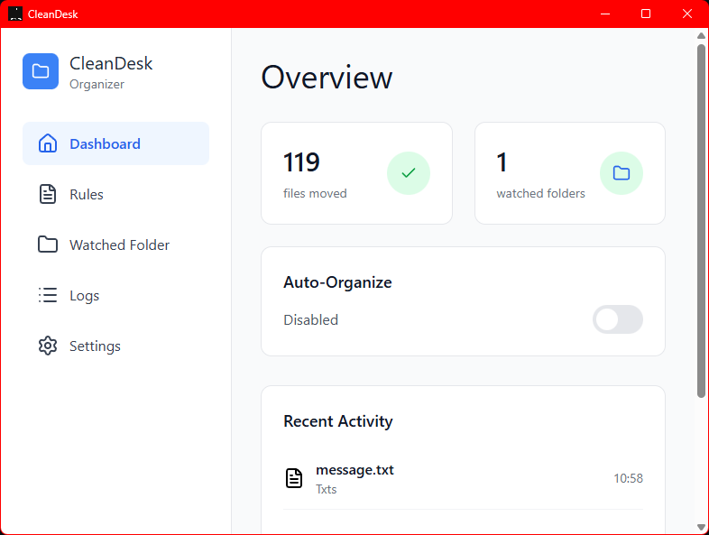

# CleanDesk

A desktop app that automatically organizes your files and keeps your workspace tidy.

## Features
- Auto-organizes files based on rules  
- Clean system tray icon  
- Logs & rule editor  
- Simple desktop UI

## Screenshots

## Installation
Download the latest release from **Releases**.

## Development
npm install in root and renderer
npm start
